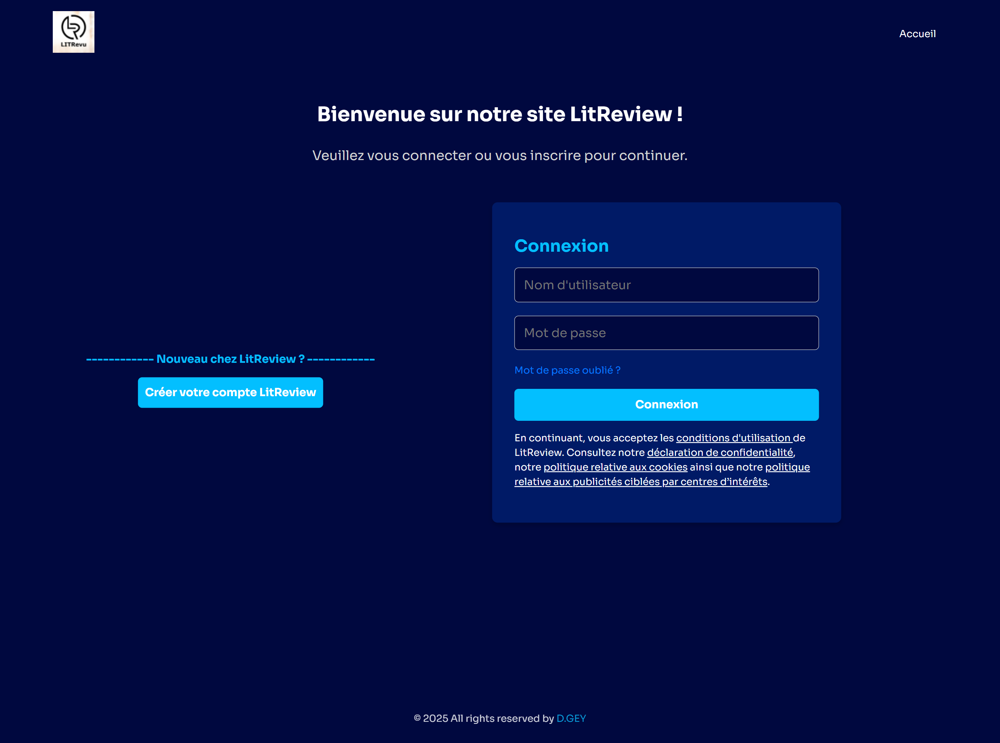
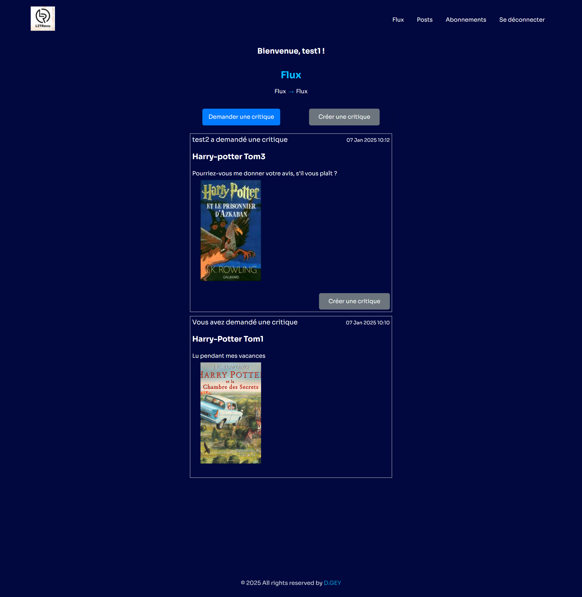
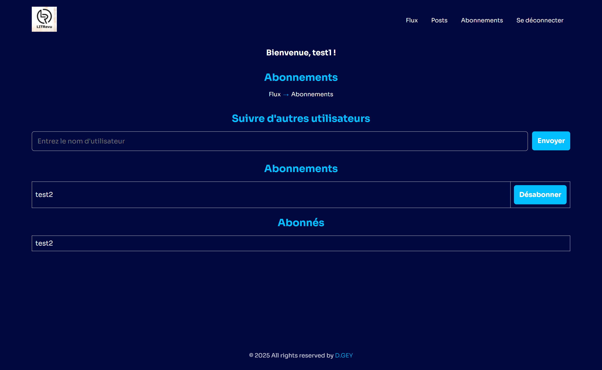
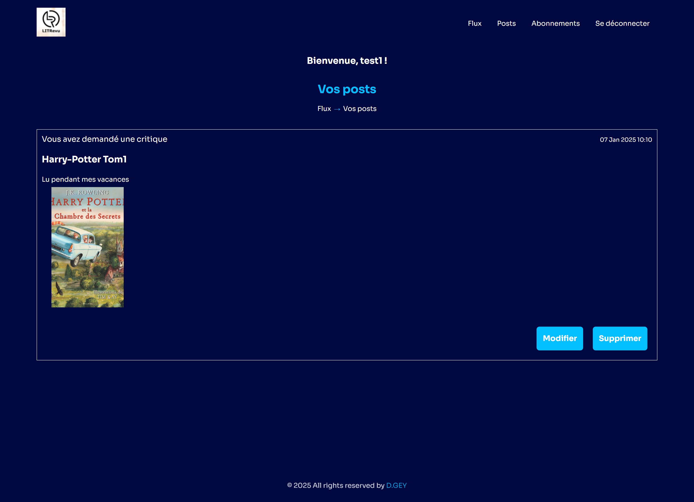

# 🌐 ***DJANGO - LITREVIEW*** 🌐
# **Application Django de publication de critiques sur des Artciles/Livres**

## 📋 Fonctionnalités

- **Création de compte utilisateur et connexion**
- **Publication de critiques** sur des articles et des livres
- **Affichage des critiques** dans un flux personnalisé
- **Modification/suppression de critiques** sur des articles et des livres
- **Recherche d'utilisateur'** par username
- **Abonnement à d'autres utilisateurs** pour voir leurs critiques dans votre flux

## 📂 Installation

Pour installer LitReview, suivez ces étapes :

1. Clonez le dépôt Git :
   ```bash
   git clone https://github.com/siwax74/P9_DJANGO_LITREVIEW
   ```
2. Activez l'environnement virtuel :
   ```bash
   source env/bin/activate # Sur Mac/Linux
   env\Scripts\activate    # Sur Windows
   ```
3. Installez les dépendances nécessaires :
   ```bash
   pip install -r requirements.txt
   ```
4. Démarrez le serveur de développement :
   ```bash
   python manage.py runserver
   ```

## 🚀 Utilisation

1. **Accédez à l'application dans votre navigateur** :
   [http://localhost:8000](http://localhost:8000)

2. **Créer un compte utilisateur** :
   - Remplissez le formulaire d'inscription Username et mot de passe.
   - Cliquez sur le bouton "S'inscrire" pour valider votre inscription.

3. **Se connecter** :
   - Connectez vous dès la page d'accueil
   - Remplissez le formulaire de connexion avec vos informations.
   - Cliquez sur le bouton "Se connecter" pour accéder à votre compte.

## Comptes de test

- **Compte 1**: (superadmin)
  - Nom d'utilisateur : `test1`
  - Mot de passe : `test1`

- **Compte 2**:
  - Nom d'utilisateur : `test2`
  - Mot de passe : `test2`

## Images de tests
    - Image 1: media/articles/Harry_potter_tom_1.jpg
    - Image 2: media/articles/Harry_potter_tom_2.jpg
    - Image 3: media/articles/Harry_potter_tom_3.jpg

## 🛠 **Maintenance et Améliorations Futures**
Voici quelques améliorations prévues pour les versions futures :
- Utilisation de TailwinCSS
- Suppression de compte
- Validation Email

## 📸 **Captures d'Écran**
Voici quelques captures d'écran de l'application en action :
<table>
    <tr>
        <td style="text-align: center;">
            <h3>Connexion</h3>
            
        </td>
    </tr>
    <tr>
        <td style="text-align: center;">
            <h3>Flux</h3>
            
        </td>
    </tr>
    <tr>
        <td style="text-align: center;">
            <h3>Followers</h3>
            
        </td>
    </tr>
    <tr>
        <td style="text-align: center;">
            <h3>Posts</h3>
            
        </td>
    </tr>
</table>

## 👨‍💻 Auteur

- **DG.**

## 📄 Licence

Ce projet est sous licence MIT. Vous êtes libre de modifier et de redistribuer le code source. Consultez le fichier `LICENSE` pour plus d'informations.

## Remerciements

Un grand merci aux contributeurs de Django et de toutes les bibliothèques utilisées dans ce projet pour leur travail incroyable !
Merci également à l'organisme de formation OpenClassrooms pour son soutien pédagogique.